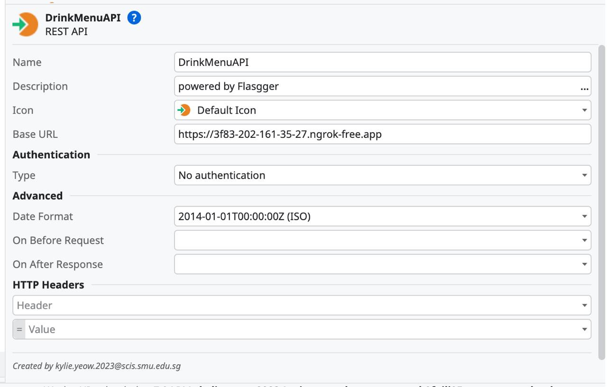

# Brew Haven

 Brew Haven is an online coffee application that allows customers to order their favourite drinks on the go. With multiple outlets across Singapore, customers can easily select the nearest location from their current location, streamlining the ordering process and saving valuable time.

## Getting Started
To Run Frontend:
- ```cd .\my-coffeeshop-app\```
- ```npm install```
- ```npm run dev```

To run the backend:
- Run Docker
- Import coffeeShop_database.sql into http://localhost/phpmyadmin/
    * On phpMyAdmin, click 'User accounts'
    * Click 'Add user account' and specify the following:
        * User name: (Use text field:) is213
        * Host name: (Any host) %
        * Password: Change to No Password
        * Select 'Data'
        * Click 'Go'
        * A new user is added
- ```cd .\my-coffeeshop-app\Backend\```
- ```docker compose up --build```
- To stop and remove containers:
    ```docker compose down```

### Ngrok
Create an account on ngrok.com <br>
Install ngrok via Homebrew with the following command:
```brew install ngrok```

Configure and run by replacing <token> with the AuthToken found on your account:
```ngrok config add-authtoken <token>```

Start an endpoint: 

* ```ngrok http 5005 (DrinkMenuAPI)```
* ```ngrok http 5006 (DrinkIngredientAPI)```
* ```ngrok http 5007 (DrinkCustomisationAPI)```
* ```ngrok http 6000 (SendSMSToCompletedOrder)```

Note: each account can create only one endpoint.
Replace the Base URL for each of the consumed REST API with the newly created endpoint.
For example: For the endpoint you get (e.g ```ngrok http 5005``` gets you the endpoint ```https://1234-123-123-12-12.ngrok-free.app```), change the Base URL for DrinkMenuAPI

